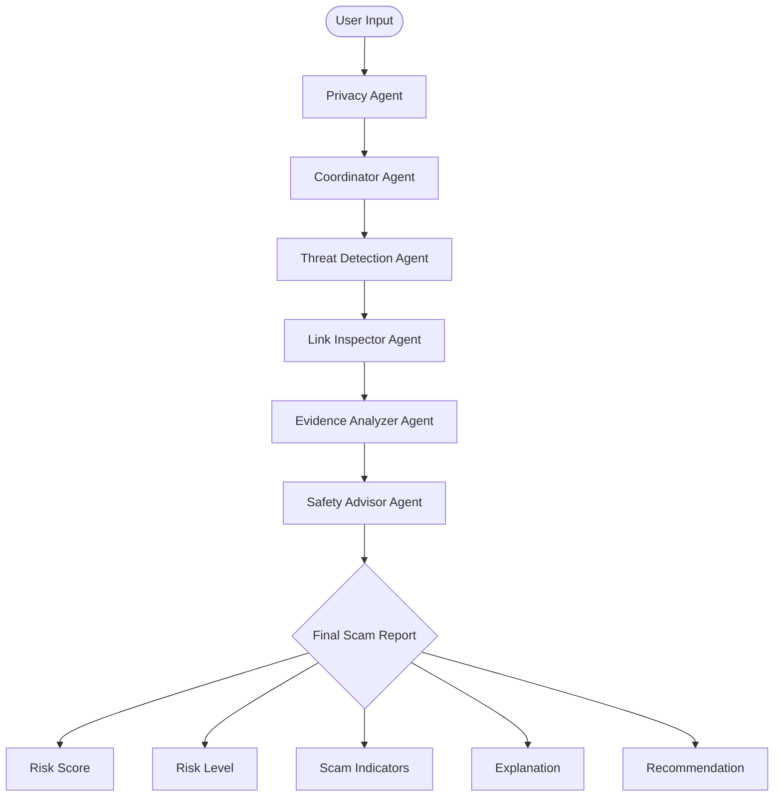

# ScamShield AI Architecture

## 1. System Overview
ScamShield AI utilizes a multi-agent system architecture to sequentially and collaboratively analyze user inputs (messages, emails, and URLs) for potential scams. By dividing the analysis pipeline into specialized intelligent agents, the system ensures structured analysis, privacy protection, and explainable risk evaluation.

## 2. Agent Responsibilities

- **Privacy Agent:** Acts as the first line of defense. Scans user input to identify and redact sensitive personally identifiable information (PII) before the data proceeds through the pipeline, ensuring user privacy is maintained.
- **Coordinator Agent:** Serves as the central orchestrator. It receives the sanitized input, determines the necessary analysis steps, routes data to the appropriate specialized agents, and aggregates their findings.
- **Threat Detection Agent:** Analyzes the linguistic and contextual components of the text. It detects urgency, manipulation, and classic social engineering tactics often present in scams.
- **Evidence Analyzer Agent:** Identifies suspicious patterns commonly found in phishing and scam attempts to validate the threat level.
- **Link Inspector Agent:** Parses and evaluates URL structure, suspicious keywords, shortened links, and deceptive domain patterns present in the input.
- **Safety Advisor Agent:** Synthesizes the collective findings from all previous agents. It generates a final, user-friendly report that explains the threat and provides prescriptive recommendations.

## 3. System Flow

The analysis pipeline follows a sequential, orchestrated flow to ensure comprehensive evaluation:

User Input
→ Privacy Agent
→ Coordinator Agent
→ Threat Detection Agent
→ Link Inspector Agent
→ Evidence Analyzer Agent
→ Safety Advisor Agent
→ Final Scam Report

## 4. Final Output

The final deliverable generated by the Safety Advisor Agent provides a clear and actionable assessment, containing the following core elements:

- **Risk Score:** A numerical value (0–100) indicating the likelihood of a scam.
- **Risk Level:** A categorical classification (Low, Medium, or High) for immediate comprehension.
- **Scam Indicators:** Specific red flags or malicious characteristics identified in the input.
- **Explanation:** Transparent, Explainable AI (XAI) reasoning detailing why the score and level were assigned.
- **Recommendation:** Actionable advice on what the user should (or should not) do next to stay safe.
